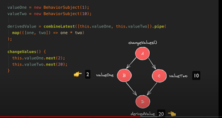
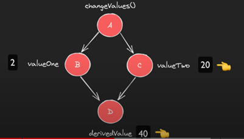

 # 1. The Zone
 Reading: https://justangular.com/blog/a-change-detection-zone-js-zoneless-local-change-detection-and-signals-story
 <br> Video Summary: https://www.youtube.com/watch?v=DbUS6h1tANQ
 <br>
 The Zone is the area that Angular displays. How does Angular know when to refresh the view? How does it know when the data changes? How does it know when to run the change detection?
 <br> The **NgZone** helps in managing the execution context and provides a method called run() that triggers change detection. Here's an example:
 ```
import { Component, Input, NgZone } from '@angular/core';

@Component({
  selector: 'app-my-component',
  template: `
    <div>{{ myProperty }}</div>
  `,
})
export class MyComponent {
  private _myProperty: string;

  @Input()
  set myProperty(value: string) {
    this._myProperty = value;
    this.onMyPropertyChange();
  }

  get myProperty(): string {
    return this._myProperty;
  }

  constructor(private ngZone: NgZone) {}

  updatePropertyManually(newValue: string): void {
    this.ngZone.run(() => {
      this.myProperty = newValue;
    });
  }

  onMyPropertyChange(): void {
    // Custom logic to handle property change
    console.log('myProperty has changed:', this.myProperty);
  }
}
```
the **updatePropertyManually()** method is wrapped inside the this.ngZone.run() function. This ensures that the property change triggers change detection and propagates the updated value throughout the application.

After manually updating an input property, we can call the ChangeDetectorRef method markForCheck() to notify Angular to run change detection on the component and its child components.
  Angular uses these strategies to determine whether a child component should be checked while running change detection for a parent component.
  >The default strategy, internally referred to as CheckAlways, implies regular automatic change detection for a component unless the view is explicitly detached.

> What’s known as OnPush strategy, internally referred to as CheckOnce, implies that change detection is skipped unless a component is marked as dirty. Angular implements mechanisms to automatically mark a component as dirty. When needed, a component can be marked dirty manually using markForCheck method exposed on ChangeDetectorRef.
## Default strategy
Default change detection strategy means that a child component will always be checked if its parent component is checked. The only exception to that rule is that if you detach a change detector of the child component like this:
```
@Component({
  selector: 'a-op',
  template: `I am OnPush component`
})
export class AOpComponent {
  constructor(private cdRef: ChangeDetectorRef) {
    cdRef.detach();
  }
}
```
## onPush aka CheckOnce strategy
change detection is skipped for a component until it’s marked as dirty, then checked once, and then skipped again. A component can be marked dirty either automatically or manually using markForCheck method.
 # 2. Signals vs. Observables
 source: https://youtu.be/4FkFmn0LmLI?si=cjbQglPLpcG1auma
 <br>
 Signals are good for Synchronous Reactivity. They are not good for Asynchronous Reactivity.
 Signals do not suffer from the Diamond Problem in which changes in the value are computed one at a time, instead of simultaneously. 
 <br>
 
 

   ## Asynchronous reactivity
   > Asynchronous reactivity – we must wait some time to set a new value. Maybe this is due to an API etc.
   Ex. Search – due to serverside processing that may terminate at different moments while typing in the searchbar
   Observables, Promises, Async functions.
   ## Synchronous reacitvity
   > Synchronous Reactivity – a value is known and can be set immediately.
   Signal, Variables, standrard functions 
# 3.  Subscriptions

# 4. Inputs
  ## Input Getters and Setters
  reading: https://blog.bitsrc.io/simplify-input-property-handling-in-angular-with-setters-and-getters-256ddca84ac1
  <br> **Setters and Getters** provide a simpler and more controlled way to handle input property changes. They encapsulate the logic within the component and offer more flexibility when performing additional validations or triggering custom methods.<br>
 
 > **Pros:** recieve parameter value and parse it immediately.<br>
 > **Cons:** no default values on getters and setters. <br>
  ```
  export class MyComponent {
  private _myProperty: string;

  @Input()
  set myProperty(value: string) {
    this._myProperty = value;
    this.onMyPropertyChange();
  }

  get myProperty(): string {
    return this._myProperty;
  }
  ```

  
  ## Input OnPush
  **Angular implements two strategies that control change detection behavior on the level of individual components. Those strategies are defined as Default and OnPush:**

  ## NgOnChanges
